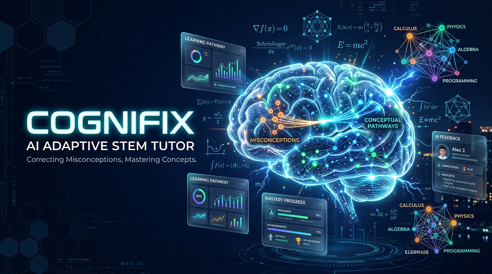

<div align="center">



# 🧠 CogniFix

### *"Fixing the Misconception, Not Just the Mistake."*

[](https://cognifix.onrender.com/)
[](https://react.dev/)
[](https://www.typescriptlang.org/)
[](https://groq.com/)
[](https://supabase.com/)
[](https://duckduckgo.com/)

---

**CogniFix** is a next-generation AI-powered adaptive STEM tutor that diagnoses the underlying cognitive trap behind a student's wrong answer rather than simply marking it incorrect. By combining a multi-agent AI architecture, live DuckDuckGo internet grounding, and continuous diagnostic mastery tracking, CogniFix repairs foundational thinking flaws and fosters genuine conceptual mastery.

🚀 **[Experience the Live Web Application &rarr;](https://cognifix.onrender.com/)**

---

</div>

## 👥 Team Xeno

Developed with passion by **Team Xeno**:

| Member | Role & Contributions |
| :--- | :--- |
| **Subhash B** | System Architecture, Multi-Agent Engine, Full-Stack Development |
| **Ezhilkumaran K** | Adaptive Diagnostics, Knowledge Graph & Mind Map Engineering |
| **Sandhya Rani Y** | UI/UX Design, Supabase Database & Security Policies |

---

## 🎯 The Core Problem & The CogniFix Solution

```
❌ Traditional Quiz / LMS Systems:
   Student Question ──▶ Wrong Answer ──▶ "Incorrect (Score: 0/1)" ──▶ Correct Answer Shown
   [The underlying reasoning misconception remains undetected and repeats in the exam]

✅ CogniFix Adaptive Approach:
   Student Question ──▶ Wrong Answer ──▶ 🧠 Root Misconception Diagnosis Agent
                                                │
                                                ▼
   Verified Remediation Problem ◀── DuckDuckGo Search Grounding ◀── Cognitive Trap Flagged
         │
         ▼
   Track Mastery & Progression ──▶ Spaced Repetition Flashcards ──▶ Adaptive Roadmap
```

Traditional test engines treat mistakes as binary outcomes (0 or 1). **CogniFix treats wrong answers as diagnostic goldmines.** Every incorrect answer reflects a specific cognitive defect—such as confusing asymptotic limit dominance, misapplying the spectral theorem, or confusing variable scopes. CogniFix pinpoints the exact trap, validates it with live web resources, and immediately provides a scaffolded remediation path.

---

## ✨ Key Features

### 1. 🔍 Root Misconception Diagnosis
- Parses student responses in real time across mathematics, physics, computer science, and engineering.
- Identifies the cognitive reasoning trap (e.g. *Arithmetic Invariance on Infinity*, *Geometric Degeneracy Bias*).
- Provides Socratic hints that guide the learner toward self-correction without spoiling the solution.

### 2. ⚡ Fresh Targeted Remediation Generation
- Automatically synthesizes a brand-new practice problem directly attacking the identified misconception.
- Verifies the mathematical rigor, theorem domain, and step-by-step logic before serving the question to the learner.

### 3. 🗺️ Adaptive Skill Roadmaps with Live DuckDuckGo Grounding
- **Interactive Skill Search**: Enter any skill or target goal (e.g., *"Python upto DSA"*).
- **Chunked Milestones**: Decomposes the skill into structured, sequential chunks:
  - *Basic Programming & Syntax* &rarr; *Idiomatic Python* &rarr; *OOP Principles* &rarr; *Linear Data Structures* &rarr; *Algorithms & Big-O* &rarr; *DSA Mastery*.
- **DuckDuckGo Live Web Search**: Queries the live internet in real time to fetch:
  - 🎥 **Video Tutorials**: Verified YouTube playlists and walkthrough lessons (`site:youtube.com`).
  - 📄 **Documentation & Cheatsheets**: Official guides, documentation, and tutorials.
  - 💻 **Practice Platforms**: Direct links to LeetCode and HackerRank problem sets.
- **Resource Completion Tracking**: Check off individual videos, docs, and practice exercises as finished.
- **Dedicated Roadmap History**: Review, switch between, and manage multiple roadmaps with persisted completion progress.

### 4. 🗂️ Spaced Retrieval Flashcards
- High-yield spaced retention flashcards targeting student vulnerabilities.
- Tracks decay levels (*Critical*, *Stable*, *Optimal*) and scheduled reviews.

### 5. 🕸️ Interactive Knowledge Mind Map
- Visual hierarchical dependency graph showing prerequisite chains and concepts.
- Flags nodes as *Mastered*, *Vulnerable*, or *Unlocked* to guide study sessions.

### 6. 📄 Multimodal Student Work Upload
- Supports uploads of student worksheets in **PDF**, **DOCX**, **JPG**, **PNG**, and **WEBP** (up to 30 MB).
- Server extracts document text and leverages vision models to diagnose handwritten or printed homework errors.

### 7. 👨‍🏫 Teacher Portal & Class Analytics
- Class-wide analytics displaying average mastery rates, active trap frequency, and student rosters.
- Enables educators to adapt classroom teaching to real-time cognitive blindspots.

---

## 🏗️ Multi-Agent System Architecture

CogniFix employs a specialized multi-agent pipeline where individual agents focus on distinct educational responsibilities:

```
                                  ┌─────────────────────────────┐
                                  │      Client (React 19)      │
                                  └──────────────┬──────────────┘
                                                 │
                                                 ▼
                                  ┌─────────────────────────────┐
                                  │   Express / Vite Backend    │
                                  └──────────────┬──────────────┘
                                                 │
         ┌───────────────────┬───────────────────┼───────────────────┬───────────────────┐
         │                   │                   │                   │                   │
         ▼                   ▼                   ▼                   ▼                   ▼
┌─────────────────┐ ┌─────────────────┐ ┌─────────────────┐ ┌─────────────────┐ ┌─────────────────┐
│ Diagnoser Agent │ │ Generator Agent │ │ Explainer Agent │ │  Roadmap Agent  │ │ Document Agent  │
│  (Groq/Gemini)  │ │  (Groq/Gemini)  │ │  (Groq/Gemini)  │ │  (Groq + DDG)   │ │ (Vision / OCR)  │
└─────────────────┘ └─────────────────┘ └─────────────────┘ └─────────────────┘ └─────────────────┘
         │                   │                   │                   │                   │
         └───────────────────┴───────────────────┼───────────────────┴───────────────────┘
                                                 │
                                  ┌──────────────┴──────────────┐
                                  │   Supabase Cloud Platform   │
                                  │ ┌─────────────────────────┐ │
                                  │ │ PostgreSQL + RLS Data   │ │
                                  │ │ Google OAuth Sessions   │ │
                                  │ │ Private Storage Bucket  │ │
                                  │ └─────────────────────────┘ │
                                  └─────────────────────────────┘
```

- **Diagnoser Agent**: Evaluates student choices and determines the cognitive trap.
- **Generator Agent**: Formulates novel, mathematically sound remediation questions.
- **Explainer Agent**: Produces step-by-step Socratic walkthroughs and theoretical proofs.
- **Roadmap Agent**: Breaks down curricula into progressive milestones and leverages DuckDuckGo for live internet video, doc, and practice grounding.
- **Document Agent**: Extracts text and analyzes uploaded PDF/Word/Image homework assignments.

---

## 🛠️ Tech Stack

- **Frontend**: React 19, TypeScript, Vite, Tailwind CSS 4, Lucide React, Motion
- **Backend**: Node.js, Express, TypeScript (`tsx`), Mammoth (DOCX), PDF-Parse (PDF)
- **AI Engines**:
  - [Groq API](https://groq.com/) (Dedicated API keys per agent for high-throughput, low-latency LLM inference)
  - Google Gemini 3.8 Flash (`@google/genai`) as high-reliability fallback
- **Search & Grounding**: DuckDuckGo Live Web Search Engine (HTML organic extractor & Instant Answers)
- **Database & Auth**: [Supabase](https://supabase.com/) (PostgreSQL with Row Level Security, Storage Buckets, OAuth)
- **Hosting & Deployment**: [Render](https://render.com/)

---

## 🚀 Getting Started

### Prerequisites
- [Node.js](https://nodejs.org/) (v18 or higher recommended)
- `npm` or `yarn`

### 1. Clone the Repository
```bash
git clone https://github.com/subhashdoc234xyz/cognifix.git
cd cognifix
```

### 2. Install Dependencies
```bash
npm install
```

### 3. Configure Environment Variables
Copy `.env.example` to `.env`:
```bash
cp .env.example .env
```

Edit `.env` with your API credentials:
```env
# Groq Dedicated Agent Keys (Recommended)
GROQ_API_KEY=your_groq_api_key
GROQ_DIAGNOSER_API_KEY=your_key
GROQ_GENERATOR_API_KEY=your_key
GROQ_EXPLAINER_API_KEY=your_key
GROQ_ROADMAP_API_KEY=your_key
GROQ_DOCUMENT_API_KEY=your_key
GROQ_MODEL=openai/gpt-oss-120b

# Google Gemini API (Optional Fallback)
GEMINI_API_KEY=your_gemini_api_key

# Supabase (Optional for cloud sync and document uploads)
SUPABASE_URL=https://your-project.supabase.co
SUPABASE_ANON_KEY=your_anon_key
SUPABASE_SECRET_KEY=your_service_or_secret_key
```

### 4. Run Development Server
```bash
npm run dev
```
Open your browser at `http://localhost:3000` to start using CogniFix!

### 5. Build for Production
```bash
npm run build
npm start
```

---

## 🔐 Supabase Database Setup

CogniFix includes battle-tested PostgreSQL schemas with complete Row-Level Security (RLS) policies:

1. Open your **Supabase Dashboard &rarr; SQL Editor**.
2. Run [`supabase-schema.sql`](./supabase-schema.sql) to generate profiles, mastery tracking, quiz history, mind maps, and roadmaps tables.
3. Run [`supabase-wrong-answer-uploads.sql`](./supabase-wrong-answer-uploads.sql) to provision the private storage bucket and upload metadata table.

---

## 🌐 Live Deployment

CogniFix is continuously deployed on Render:
🔗 **[https://cognifix.onrender.com/](https://cognifix.onrender.com/)**

---

<div align="center">

Made with 💙 by **Team Xeno**  
*Subhash B • Ezhilkumaran K • Sandhya Rani Y*

</div>
